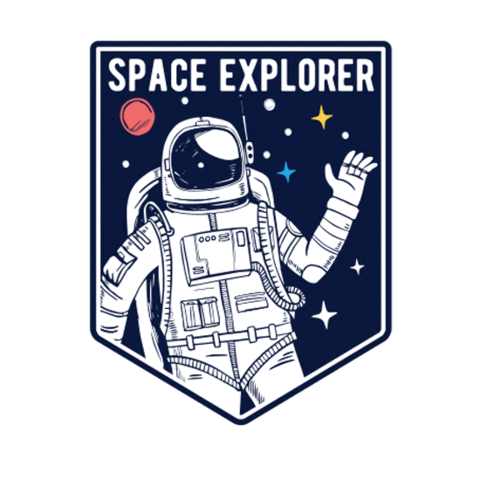

# The EstelarClass!

<p align="center"></p>

<p align="justify"> &emsp; O <b>EstelarClass</b> é um sistema projetado para a <b><i> ANÁLISE COMPARATIVA DE MÉTODOS DE APRENDIZADO DE MÁQUINA PARA A IDENTIFICAÇÃO DE EXOPLANETAS EM TRÂNSITO </i></b>.
<br/>

 &emsp; Utilizando os conjuntos de dados K2, KEPLER e TESS da NASA (disponíveis ao final desta informação), será realizada uma <b><i> AVALIAÇÃO DA EFICÁCIA DOS ALGORITMOS DE CLASSIFICAÇÃO</i></b>.</p>

 <br/>

 &emsp; Este projeto está sendo desenvolvido para a conclusão do curso de Ciência da Computação na UNESC com a assistência do Dr. Leandro Neckel ([@leandroneckel](https://github.com/leandroneckel)) e do Me. André Ruaro.

<p align="center"></p>

## Resumo:

<p align="justify">  &emsp; A busca por exoplanetas, planetas que orbitam estrelas fora do nosso sistema solar, tem sido um campo de pesquisa dinâmico e emocionante na astronomia contemporânea. Nos últimos vinte e cinco anos, progressos notáveis foram alcançados, impulsionados pelo desenvolvimento de telescópios espaciais de alta precisão, fornecendo uma riqueza de informações sobre a população de exoplanetas e transformando a compreensão do universo. A detecção de exoplanetas durante trânsitos  revela dados cruciais sobre suas atmosferas e composição. Isso tem despertado um interesse crescente na análise de conjuntos de dados provenientes de missões da NASA, com cientistas de dados e entusiastas de aprendizado de máquina explorando novas formas de interpretar esses dados e prever anomalias. Embora os algoritmos de aprendizado de máquina ofereçam uma abordagem promissora para a identificação automatizada de exoplanetas, a falta de interpretabilidade desses métodos tem sido uma limitação significativa. Portanto, este estudo propõe uma análise comparativa dos métodos de aprendizado de máquina aplicados à identificação de exoplanetas em trânsito, com foco na avaliação da eficácia dos algoritmos de classificação, utilizando cinco tipos de métodos de aprendizado de máquina, técnicas de pré-processamento de dados e otimização através de hiperparametros. Espera-se que este estudo forneça resultados importantes sobre quais técnicas têm o potencial de auxiliar a capacidade de identificar e categorizar exoplanetas de forma eficiente, contribuindo assim para o avanço da ciência de exoplanetas e oferecendo orientação para a análise de dados em missões espaciais futuras.</p>

## Base de dados utilizadas:

<ul>
  <li align="justify"><a href="https://exoplanetarchive.ipac.caltech.edu/cgi-bin/TblView/nph-tblView?app=ExoTbls&config=cumulative"> Kepler </a>: O banco de dados Kepler, criado a partir da missão homônima da NASA lançada em 2009 e concluída em 2018, foi uma fonte inestimável de observações detalhadas de exoplanetas. A extensão e a precisão das observações contidas fornecem uma base sólida para a pesquisa de exoplanetas em trânsito. Com o maior número de registros entre as missões de busca de exoplanetas, o banco de dados Kepler é fundamental para o treinamento eficaz dos modelos, aumentando significativamente a precisão das análises e das descobertas subsequentes. </li>
  <li align="justify"><a href="https://exoplanetarchive.ipac.caltech.edu/cgi-bin/TblView/nph-tblView?app=ExoTbls&config=k2pandc"> K2 </a>: A missão K2 da NASA, sucessora da missão Kepler, ampliou nosso entendimento sobre exoplanetas com observações detalhadas de diversas regiões do espaço. Lançada em 2014 após o término da missão principal do Kepler, a missão K2 continuou a coletar dados valiosos até 2018. Embora sua base de dados contenha menos registros, ela possui um grande número de exoplanetas confirmados, o que é fundamental para o treinamento dos modelos e aprimoramento das análises.</li>
  <li align="justify"><a href="https://exoplanetarchive.ipac.caltech.edu/cgi-bin/TblView/nph-tblView?app=ExoTbls&config=TOI"> TESS </a>: A missão TESS da NASA, lançada em abril de 2018, revolucionou a busca por exoplanetas ao monitorar grandes áreas do céu em busca de trânsitos planetários. Atualmente ativa, TESS continua a fornecer dados abrangentes e atualizados, essenciais para a pesquisa de exoplanetas. Suas descobertas são fundamentais para acompanhar os avanços na busca por novos mundos além do nosso sistema solar.</li>
</ul>

## Como instalar:

Para o desenvolvimento desse projeto, foi utilizado a versão 3.11.9 do python. Certifique-se que o mesmo está instalado em sua máquina. Além disso, utilizamos o versionamento do git e o sistema operacional Windows 10. Recomendamento executar o projeto no VSCODE.

1. Abra o terminal ou prompt de comando e navegue até o diretório onde deseja instalar o projeto. Execute o seguinte comando para clonar o repositório do GitHub (Esse passo é necessário somente no caso de você não ter o Script):
```bash
git clone https://github.com/jnnastti/EstelarClass.git
```
2. Crie o ambiente virtual venv no terminal como administrador dentro da pasta do projeto:
```bash
python -m venv venv
```

3. Abra o projeto no VSCODE e ative o venv no terminal:
```bash
./venv/Scripts/Activate.ps1
```
Caso dê problema de execução de scripts no windows, será necessário habilitar o windows para rodar scripts por meio do Powershell.

4. Instale os pacotes:
```bash
pip install -r requirements_final.txt
```

5. Instale a extensão Python + Jupyter no VSCODE.

## Como executar:

1. Acesse e execute com o venv todos os arquivos de preprocessamento das bases (exemplo: k2_preprocessing.ipynb);
2. Verifique se os arquivos .pkl foram criados corretamente dentro da pasta de 
cada base na pasta /data;
3. Acesse e execute com o venv todos os arquivos das bases (exemplo: k2_base.ipynb);
4. Assegure que todos os quatro arquivos finalizaram sua execução;
5. Acesse e execute com o venv o EstelarClass.ipynb e aguarde até a finalização da execução para ter acesso a todos os resultados.
<hr/>
<p align="center"></p>
<h5 align="center"><a href="https://drive.google.com/file/d/1b-bkpaNTlPFzecCm-XZ-jTiWm5DZsnJ-/view?usp=sharing"> Acesse o relatório final aqui</a></h5>
